# Predicting Patient No-Shows in Brazilian Medical Appointments

> **Exploratory Data Analysis of 110,526 Medical Appointment Records — Vitória, Espírito Santo, Brazil (2016)**

[](https://python.org)
[](https://pandas.pydata.org)
[](https://numpy.org)
[](https://jupyter.org)
[](https://seaborn.pydata.org)
[](LICENSE)

---

## Table of Contents

- [Project Overview](#-project-overview)
- [Key Findings at a Glance](#-key-findings-at-a-glance)
- [Dataset](#-dataset)
- [Research Questions](#-research-questions)
- [Architecture](#-architecture)
- [Project Structure](#-project-structure)
- [Installation & Setup](#-installation--setup)
- [Usage](#-usage)
- [Results Summary](#-results-summary)
- [Visualisations](#-visualisations)
- [Limitations](#-limitations)
- [Future Research](#-future-research)
- [References](#-references)

---

## Project Overview

Medical appointment **no-shows** represent a critical operational challenge for healthcare systems. When a patient fails to attend a scheduled appointment without prior cancellation, the consequences cascade across the system: wasted clinical capacity, reduced access for other patients, and deteriorating health outcomes for the absentees.

This project conducts a comprehensive **Exploratory Data Analysis (EDA)** of 110,526 medical appointment records from Brazil to answer one central question:

> **What patient and scheduling factors are most strongly associated with missing a medical appointment?**

The analysis investigates six targeted research questions, computes Pearson correlations, grouped statistics, interaction effects, and produces 12+ publication-quality visualisations. All findings are presented as **associational and exploratory** — causal inference is explicitly avoided.

### Why This Matters

| Impact Area | Detail |
|---|---|
|  **Healthcare throughput** | ~20% of all appointments are wasted; reducing this by 5pp frees ~5,500 slots/year |
|  **Cost efficiency** | No-shows cost the NHS (UK) alone ~£1 billion/year — Brazil's SUS faces similar pressures |
|  **Targeted intervention** | Identifying high-risk patients enables proportionate, cost-effective outreach |
|  **ML readiness** | Feature-importance findings directly feed into a future predictive model |

---

## ⚡ Key Findings at a Glance

| # | Research Question | Key Stat | Direction |
|---|---|---|---|
| Q1 | Wait time vs no-show rate | Same-day: **4.7%** → 60+ days: **28.4%** | ↑ Wait = ↑ No-show |
| Q2 | Age group influence | Teens: **26.1%** vs Seniors: **15.2%** | Younger = higher risk |
| Q3 | Chronic conditions | Hypertension patients: **17.3%** vs 20.9% | Condition = protective |
| Q4 | SMS reminders | Raw: 27.6% vs 16.7% — *confounded by wait time* | Confounding artefact |
| Q5 | Day of week | Friday: **21.2%** vs Thursday: **19.4%** | Minor effect |
| Q6 | Feature importance | `WaitDays` strongest: **\|r\| = 0.186** | Top predictor identified |

> **Bottom line**: `WaitDays` is the single strongest predictor. Neighbourhood, Age, and Scholarship status also carry meaningful signal. Gender and Alcoholism show negligible association.

---

## Dataset

### Source

| Attribute | Detail |
|---|---|
| **Name** | No-Show Appointments |
| **Origin** | Kaggle — compiled by Aquarela Advanced Analytics |
| **File** | `noshowappointments-kagglev2-may-2016.csv` |
| **Records** | 110,527 raw → **110,526** after cleaning |
| **Columns** | 14 original + 5 engineered |
| **Period** | 2016 (Vitória, Espírito Santo, Brazil) |
| **Missing values** | None |
| **Duplicates** | None |

### Column Reference

| Column | Type | Description |
|---|---|---|
| `PatientId` | Integer | Unique patient identifier |
| `AppointmentID` | Integer | Unique appointment identifier |
| `Gender` | Categorical (F/M) | Patient gender |
| `ScheduledDay` | Datetime | Date/time appointment was booked |
| `AppointmentDay` | Datetime | Date of the actual appointment |
| `Age` | Integer | Patient age in years |
| `Neighbourhood` | Categorical (81 values) | Location of the clinic |
| `Scholarship` | Binary | Enrolled in Bolsa Família welfare programme |
| `Hipertension` | Binary | Has hypertension *(renamed `Hypertension`)* |
| `Diabetes` | Binary | Has diabetes |
| `Alcoholism` | Binary | Has alcoholism |
| `Handcap` | Integer 0–4 | Number of disabilities *(renamed `Disability`)* |
| `SMS_received` | Binary | Received an SMS reminder |
| `No-show` | Categorical | ⚠️ **`'Yes'` = did NOT attend; `'No'` = attended** |

> ⚠️ **Encoding Warning**: The target column is counter-intuitive. `No-show = 'Yes'` means the patient **missed** the appointment. This is converted to a numeric `NoShow` column (`1` = missed, `0` = attended) throughout the analysis.

### Class Distribution

```
Showed Up (No-show = 'No'):   88,208  →  79.8%
No-Show   (No-show = 'Yes'):  22,318  →  20.2%
```

### Engineered Features

| Feature | Description |
|---|---|
| `WaitDays` | Days between `ScheduledDay` and `AppointmentDay` (clipped to ≥ 0) |
| `AppointmentDOW` | Day of week of the appointment |
| `AgeGroup` | Life-stage bins: Child / Teen / Young Adult / Adult / Senior |
| `ChronicCondition` | `1` if any of Hypertension, Diabetes, or Alcoholism is present |
| `WaitBucket` | Wait time categories: Same Day / 1–7 / 8–30 / 31–60 / 60+ days |

---

## Research Questions

| # | Question | Variables |
|---|---|---|
| **Q1** | How does waiting time relate to no-show rates? | `WaitDays`, `WaitBucket` |
| **Q2** | Does patient age group influence no-shows? | `Age`, `AgeGroup` |
| **Q3** | Are chronic condition patients more reliable? | `Hypertension`, `Diabetes`, `Alcoholism` |
| **Q4** | Do SMS reminders reduce no-shows? | `SMS_received`, `WaitDays` |
| **Q5** | Does day of the week affect attendance? | `AppointmentDOW` |
| **Q6** | What features best predict show-up? | All features — Pearson correlations, effect sizes |

---

## Architecture

The project follows a five-stage reproducible data science pipeline implemented in a single Jupyter Notebook.

```mermaid
%%{init: {
  "theme": "base",
  "themeVariables": {
    "primaryColor": "#1F4E79",
    "primaryTextColor": "#FFFFFF",
    "primaryBorderColor": "#0C3058",
    "lineColor": "#5B9BD5",
    "secondaryColor": "#E8F4FD",
    "tertiaryColor": "#F0F7FF",
    "background": "#FFFFFF",
    "mainBkg": "#1F4E79",
    "nodeBorder": "#0C3058",
    "clusterBkg": "#F0F7FF",
    "clusterBorder": "#5B9BD5",
    "edgeLabelBackground": "#EBF5FB",
    "fontSize": "15px",
    "fontFamily": "Arial, sans-serif"
  }
}}%%

flowchart TD

    %% ── STAGE 1: DATA INGESTION ─────────────────────────────────────
    subgraph INGEST ["📥  Stage 1 · Data Ingestion"]
        direction TB
        A1["🗂️  Raw CSV File\nnoshowappointments-\nkagglev2-may-2016.csv"]:::source
        A2["📦  pd.read_csv()\n110,527 rows × 14 cols"]:::ingest
        A3["🔎  Initial Inspection\n.shape · .info() · .describe()\n.isnull() · .value_counts()"]:::ingest
        A1 --> A2 --> A3
    end

    %% ── STAGE 2: DATA WRANGLING ─────────────────────────────────────
    subgraph WRANGLE ["🧹  Stage 2 · Data Wrangling"]
        direction TB
        B1["🗑️  Remove Invalid Ages\nAge = -1  →  1 row dropped\n110,526 records remain"]:::clean
        B2["📅  Parse Datetimes\nScheduledDay & AppointmentDay\n→ datetime64 (UTC-aware)"]:::clean
        B3["✂️  Clip Negative WaitDays\nTimezone artefacts → 0\n5 records adjusted"]:::clean
        B4["✏️  Rename Columns\nHipertension → Hypertension\nHandcap → Disability"]:::clean
        B1 --> B2 --> B3 --> B4
    end

    %% ── STAGE 3: FEATURE ENGINEERING ───────────────────────────────
    subgraph ENGINEER ["⚙️  Stage 3 · Feature Engineering"]
        direction TB
        C1["⏱️  WaitDays\nAppointmentDay − ScheduledDay\n(integer days, clipped ≥ 0)"]:::feat
        C2["📆  AppointmentDOW\nDay-of-week name\nMonday … Saturday"]:::feat
        C3["👥  AgeGroup\npd.cut() → 5 life-stage bins\nChild · Teen · YoungAdult · Adult · Senior"]:::feat
        C4["💊  ChronicCondition\nOR(Hypertension, Diabetes,\nAlcoholism) → binary flag"]:::feat
        C5["🪣  WaitBucket\nSame Day / 1–7 / 8–30\n31–60 / 60+ days"]:::feat
        C6["🎯  NoShow (target)\n'Yes' → 1  ·  'No' → 0\nBinary numeric target"]:::target
        C1 --- C2 --- C3
        C4 --- C5 --- C6
    end

    %% ── STAGE 4: EXPLORATORY DATA ANALYSIS ─────────────────────────
    subgraph EDA ["🔬  Stage 4 · Exploratory Data Analysis"]
        direction TB

        subgraph UNIVAR ["📊  Univariate  (1D)"]
            D1["Age distribution\nhistogram"]:::viz
            D2["NoShow pie chart\n20.2% no-show"]:::viz
            D3["WaitDays histogram\nright-skewed"]:::viz
        end

        subgraph BIVAR ["📈  Bivariate  (2D)"]
            E1["Q1 · Wait Time\nSame-day 4.7% → 28.4%\nPearson r = 0.186"]:::analysis
            E2["Q2 · Age Group\nTeen 26.1% vs Senior 15.2%"]:::analysis
            E3["Q3 · Chronic Conditions\nHypertension: 17.3% vs 20.9%"]:::analysis
            E4["Q4 · SMS Reminders\nConfounded by WaitDays"]:::analysis
            E5["Q5 · Day of Week\nFriday 21.2% vs Thursday 19.4%"]:::analysis
        end

        subgraph MULTIVAR ["🗺️  Multi-variable  (nD)"]
            F1["Q6 · Feature Importance\nCorrelations ranked\nall 9 predictors"]:::feature
            F2["Heatmaps\nAgeGroup × Scholarship\nCondition × SMS"]:::feature
            F3["Neighbourhood Analysis\n81 areas · range 14.6%–28.9%\nTop/bottom 10 ranked"]:::feature
        end

        UNIVAR --> BIVAR --> MULTIVAR
    end

    %% ── STAGE 5: OUTPUTS ────────────────────────────────────────────
    subgraph OUTPUT ["📤  Stage 5 · Outputs"]
        direction LR
        G1["📓  Jupyter Notebook\n.ipynb (executed)"]:::out
        G2["🌐  HTML Report\n.html (nbconvert)"]:::out
        G3["📄  Word Report\n.docx (12 sections)"]:::out
        G4["📋  README\nProject documentation"]:::out
    end

    %% ── INTER-STAGE CONNECTIONS ─────────────────────────────────────
    INGEST   --> WRANGLE
    WRANGLE  --> ENGINEER
    ENGINEER --> EDA
    EDA      --> OUTPUT

    %% ── HELPER FUNCTIONS ────────────────────────────────────────────
    subgraph HELPERS ["🛠️  Reusable Functions"]
        direction LR
        H1["label_plot()\nConsistent axis\nformatting"]:::helper
        H2["noshow_rate_barplot()\nStandardised bar\ncharts with %"]:::helper
    end

    HELPERS -.->|"used across\nall 12 charts"| EDA

    %% ── COLOUR CLASSES ──────────────────────────────────────────────
    classDef source    fill:#1F4E79,stroke:#0C3058,color:#FFFFFF,rx:8
    classDef ingest    fill:#2E75B6,stroke:#1F4E79,color:#FFFFFF,rx:6
    classDef clean     fill:#107C10,stroke:#054B05,color:#FFFFFF,rx:6
    classDef feat      fill:#7030A0,stroke:#4B1080,color:#FFFFFF,rx:6
    classDef target    fill:#C00000,stroke:#800000,color:#FFFFFF,rx:6
    classDef viz       fill:#0070C0,stroke:#004C8C,color:#FFFFFF,rx:6
    classDef analysis  fill:#00B0F0,stroke:#007DC0,color:#1F3040,rx:6
    classDef feature   fill:#FF7C00,stroke:#C05000,color:#FFFFFF,rx:6
    classDef out       fill:#375623,stroke:#1E3614,color:#FFFFFF,rx:6
    classDef helper    fill:#833C00,stroke:#5A2800,color:#FFFFFF,rx:6
```



### Technology Stack

| Layer | Tools |
|---|---|
| **Language** | Python 3.10+ |
| **Data manipulation** | Pandas 2.x, NumPy |
| **Visualisation** | Matplotlib, Seaborn |
| **Development** | Jupyter Notebook |
| **Export** | nbconvert (HTML), Node.js docx (Word) |

---

## Project Structure

```
medical-noshow-eda/
│
├──  noshowappointments-kagglev2-may-2016.csv   # Raw dataset (110,527 records)
│
├──  Investigate_a_Dataset.ipynb                # Main analysis notebook (source)
├──  Investigate_a_Dataset_executed.ipynb       # Executed notebook with outputs
├──  Investigate_a_Dataset.html                 # HTML export of executed notebook
│
├──  NoShow_Analysis_Report.docx                # Full Word report (10 sections)
│
├──  README.md                                  # This file
│
└──  figures/                                   # Generated visualisation PNGs
    ├── fig_univariate.png                         # Target, age, wait distributions
    ├── fig_waittime.png                           # Q1: wait time analysis
    ├── fig_agegroup.png                           # Q2: age group analysis
    ├── fig_conditions.png                         # Q3: chronic conditions
    ├── fig_sms.png                                # Q4: SMS reminder analysis
    ├── fig_dow.png                                # Q5: day of week analysis
    ├── fig_heatmaps.png                           # Combined interaction heatmaps
    ├── fig_feature_importance.png                 # Q6: ranked feature importance
    ├── fig_neighbourhood.png                      # Q6: top/bottom neighbourhoods
    └── fig_q6_summary.png                        # Q6: comprehensive summary
```

---

## Installation & Setup

### Prerequisites

- Python 3.10 or higher
- pip or conda package manager

### 1. Clone the repository

```bash
git clone https://github.com/yourusername/medical-noshow-eda.git
cd medical-noshow-eda
```

### 2. Create a virtual environment

```bash
# Using venv
python -m venv venv
source venv/bin/activate          # macOS/Linux
venv\Scripts\activate             # Windows

# OR using conda
conda create -n noshow python=3.10
conda activate noshow
```

### 3. Install dependencies

```bash
pip install pandas numpy matplotlib seaborn jupyter nbconvert
```

Or using the requirements file:

```bash
pip install -r requirements.txt
```

### 4. Download the dataset

Download `noshowappointments-kagglev2-may-2016.csv` from [Kaggle](https://www.kaggle.com/datasets/joniarranz/noshowappointments) and place it in the project root directory.

### 5. Launch Jupyter

```bash
jupyter notebook Investigate_a_Dataset.ipynb
```

---

## Usage

### Run the full analysis

Open `Investigate_a_Dataset.ipynb` in Jupyter and run all cells (Kernel → Restart & Run All).

### Export to HTML

```bash
jupyter nbconvert --to html --execute Investigate_a_Dataset.ipynb
```

### Key code patterns used

```python
import pandas as pd
import numpy as np
import matplotlib.pyplot as plt
import seaborn as sns

# Load data
df = pd.read_csv('noshowappointments-kagglev2-may-2016.csv')

# Engineer wait days (vectorised — no loops)
df['ScheduledDay']   = pd.to_datetime(df['ScheduledDay'], utc=True)
df['AppointmentDay'] = pd.to_datetime(df['AppointmentDay'], utc=True)
df['WaitDays'] = (df['AppointmentDay'].dt.normalize()
                  - df['ScheduledDay'].dt.normalize()).dt.days.clip(lower=0)

# Binary target
df['NoShow'] = (df['No-show'] == 'Yes').astype(int)

# No-show rate by any grouping (reusable pattern)
df.groupby('AgeGroup', observed=True)['NoShow'].mean()
```

---

## Results Summary

### Q1 — Wait Time is the Dominant Factor

| Wait Bucket | No-Show Rate |
|---|---|
| Same Day | **4.7%** ✅ |
| 1–7 days | 24.1% |
| 8–30 days | 31.7% |
| 31–60 days | 34.2% |
| 60+ days | **28.4%** ⚠️ |

- Median wait days for **no-shows**: 11 days vs **2 days** for attendees
- Pearson correlation: **r = 0.186** (strongest single predictor)

### Q2 — Age Has a Non-Linear Effect

| Age Group | No-Show Rate |
|---|---|
| Child (0–12) | 21.0% |
| **Teen (13–18)** | **26.1%** 🔴 highest |
| Young Adult (19–35) | 23.8% |
| Adult (36–60) | 19.1% |
| **Senior (61+)** | **15.2%** 🟢 lowest |

### Q3 — Chronic Conditions Are Protective

| Condition | Has Condition | No Condition |
|---|---|---|
| Hypertension | **17.3%** | 20.9% |
| Diabetes | **18.0%** | 20.4% |
| Alcoholism | 20.1% | 20.2% |

### Q4 — SMS Reminders: The Confounding Problem

Raw rates suggest SMS recipients miss **more** appointments (27.6% vs 16.7%), but this is entirely explained by confounding:

```
Mean wait days — No SMS:        6.0 days
Mean wait days — SMS Received: 19.0 days
```

**Conclusion**: SMS reminders are sent for longer-lead appointments, which already carry higher no-show risk. The confounding factor (WaitDays) must be controlled for to measure the true reminder effect.

### Q5 — Day of Week: Minor Effect

No-show rates range from **19.4% (Thursday)** to **21.2% (Friday)** — a ~2pp spread, suggesting day of week has limited practical significance for targeting interventions.

### Q6 — Feature Importance Ranking

| Rank | Feature | \|Pearson r\| | Direction |
|---|---|---|---|
| 1 | **Wait Days** | **0.186** | Longer wait → more no-shows |
| 2 | SMS Received *(confounded)* | 0.126 | — |
| 3 | Age | 0.060 | Younger → more no-shows |
| 4 | Neighbourhood | ~0.030 | 14.6%–28.9% range |
| 5 | Scholarship (Bolsa Família) | 0.029 | Welfare → more no-shows |
| 6 | Hypertension | 0.036 | Condition → fewer no-shows |
| 7 | Diabetes | 0.015 | Condition → fewer no-shows |
| 8 | Disability | 0.006 | Negligible |
| 9 | Alcoholism | <0.001 | Negligible |

---

## Visualisations

The notebook produces **10 figures** across 6 research questions:

| Figure | Description |
|---|---|
| `fig_univariate` | 3-panel: target distribution (pie), age histogram, wait days histogram |
| `fig_waittime` | Wait-day density overlay + no-show rate bar chart by bucket |
| `fig_agegroup` | Age density overlay + no-show rate bar chart by age group |
| `fig_conditions` | Grouped bar (condition on/off) + Hypertension × Diabetes heatmap |
| `fig_sms` | SMS no-show rate bar + SMS × WaitBucket interaction line plot |
| `fig_dow` | Appointments per DOW bar + no-show rate by DOW bar |
| `fig_heatmaps` | AgeGroup × Scholarship + AgeGroup × SMS interaction heatmaps |
| `fig_feature_importance` | Horizontal ranked bar — all 9 features, colour-coded by strength |
| `fig_neighbourhood` | Top/bottom 10 neighbourhoods with overall average line |
| `fig_q6_summary` | Condition × Scholarship heatmap + key patient segment comparison |

All figures are saved as `.png` files (120 dpi) in the working directory during notebook execution.

---

## Limitations

1. **Observational design** — All associations are correlational. No causal claims can be made.
2. **Confounding** — The SMS × WaitDays relationship is a demonstrated example; other confounders are likely unexamined.
3. **Missing variables** — Appointment type, patient distance from clinic, employment status, and reason for cancellation are absent.
4. **Geographic scope** — Data is from one Brazilian city (Vitória, ES). Findings may not generalise.
5. **Temporal scope** — Covers only 2016; seasonal variation and post-2016 policy changes cannot be captured.
6. **Disability encoding** — Values 2–4 in `Handcap`/`Disability` are undefined in documentation; only 0.5% of records.
7. **Class imbalance** — 80:20 split; would require stratified sampling or class-weighting for any predictive model.

---

## 🔭 Future Research

- [ ] **Predictive modelling** — Logistic regression / gradient boosting with the top features (WaitDays, Age, Neighbourhood, Scholarship)
- [ ] **Causal inference** — Quasi-experimental design to estimate the true effect of SMS reminders controlling for WaitDays
- [ ] **Neighbourhood enrichment** — Join external socioeconomic data (IDHM, transport access) to explain the 2× geographic variation
- [ ] **Longitudinal analysis** — Link records to individual histories to study repeat no-show behaviour
- [ ] **Feature interactions** — SHAP values / interaction terms to find high-risk patient segments
- [ ] **Generalisation** — Replicate across other Brazilian cities, years, and healthcare systems
- [ ] **Intervention evaluation** — Rigorous RCT or pre/post design to test targeted outreach strategies

---

## References

1. Aquarela Advanced Analytics. (2016). *No-Show Appointments Dataset*. Kaggle. https://www.kaggle.com/datasets/joniarranz/noshowappointments
2. George, A., & Rubin, G. (2003). Non-attendance in general practice: A systematic review. *Family Practice*, 20(2), 178–184.
3. Huang, Y., & Hanauer, D. A. (2014). Patient no-show predictive model development using multiple data sources. *Applied Clinical Informatics*, 5(3), 836–860.
4. Carreras, G., et al. (2020). Machine learning models for prediction of no-show appointments. *Journal of Biomedical Informatics*, 109, 103520.
5. McKinney, W. (2010). Data structures for statistical computing in Python. *Proc. 9th Python in Science Conference*, 51–56.
6. Virtanen, P., et al. (2020). SciPy 1.0: Fundamental algorithms for scientific computing in Python. *Nature Methods*, 17(3), 261–272.
7. Nelson, A., et al. (2019). Predicting scheduled appointment adherence using electronic health record data. *JAMIA Open*, 2(1), 56–63.
8. Swain, J., et al. (2020). Missed appointments in healthcare: Causes, consequences, and interventions. *Int. J. Environmental Research and Public Health*, 17(21), 7986.
9. Ministério da Saúde, Brasil. (2016). *Bolsa Família Programme Overview*. https://www.saude.gov.br
10. Pedregosa, F., et al. (2011). Scikit-learn: Machine learning in Python. *JMLR*, 12, 2825–2830.

---

## License

This project is released under the [MIT License](LICENSE).

---

## Acknowledgements

- Dataset sourced from [Kaggle](https://www.kaggle.com/datasets/joniarranz/noshowappointments) — originally compiled by **Aquarela Advanced Analytics** and published by **JoniHoppen**.
- Analysis conducted as part of the Udacity Data Analyst Nanodegree curriculum project framework.
- Brazil's public health system (SUS) and the Bolsa Família programme staff whose data collection made this research possible.

---

<p align="center">
  <strong>Made with 🐍 Python · 🐼 Pandas · 📊 Matplotlib · 📓 Jupyter</strong><br>
  <em>Vitória, Espírito Santo, Brazil — 2016 Medical Appointment Data</em>
</p>
